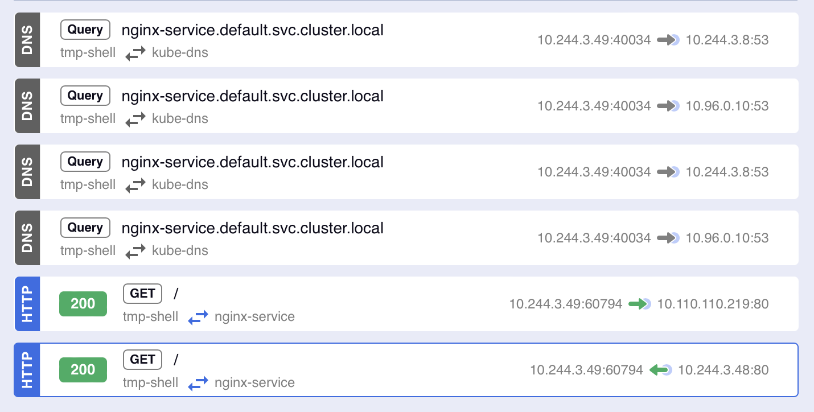

# Pod to Service communication

A [Service](https://kubernetes.io/docs/concepts/services-networking/service/) serves as a central entry point that allows Pods to communicate with one another. For instance, when a group of Pods (referred to as "backends") offers functionality to other Pods (known as "frontends") within your cluster, the backend Service will furnish the frontend with a list of backend Pods that the frontend can establish connections with.

There are four [Kubernetes Service types](https://kubernetes.io/docs/concepts/services-networking/service/#publishing-services-service-types):

- [ClusterIP](./pod-to-service.md#clusterip)
- NodePort
- LoadBalancer
- ExternalName

## DNS

Kubernetes creates [DNS records for Services](https://kubernetes.io/docs/concepts/services-networking/dns-pod-service/#services). You can contact Services with consistent DNS names instead of IP addresses.

"Normal" (not headless) Services are assigned DNS A and/or AAAA records, depending on the IP family or families of the Service, with a name of the form `my-svc.my-namespace.svc.cluster-domain.example``. This resolves to the cluster IP of the Service.

Headless Services (without a cluster IP) Services are also assigned DNS [A and/or AAAA records](https://en.wikipedia.org/wiki/List_of_DNS_record_types), with a name of the form `my-svc.my-namespace.svc.cluster-domain.example`. Unlike normal Services, this resolves to the set of IPs of all of the Pods selected by the Service. Clients are expected to consume the set or else use standard round-robin selection from the set.

## ClusterIP

ClusterIP is is the default type of Service. Kubernetes will assign an IP address from a pool of IP addresses that your cluster has reserved for that purpose.

Deploy the NGINX web server, and let's see how the ClusterIP is in action:

```bash
kubectl apply -f ../manifests/nginx-deployment.yaml
kubectl get svc
```

Output:

```bash
NAME            TYPE        CLUSTER-IP       EXTERNAL-IP   PORT(S)   AGE
kubernetes      ClusterIP   10.96.0.1        <none>        443/TCP   197d
nginx-service   ClusterIP   10.110.110.219   <none>        80/TCP    6s
```

Use the [nicolaka/netshoot](https://hub.docker.com/r/nicolaka/netshoot) image to execute network validations.

```bash
kubectl run tmp-shell --rm -i --tty --image nicolaka/netshoot -- /bin/bash
```

First, use [nslookup](https://www.ibm.com/docs/en/aix/7.2?topic=n-nslookup-command) to query the DNS for the Service name:

```bash
tmp-shell:~# nslookup nginx-service
Server:         10.96.0.10
Address:        10.96.0.10#53

Name:   nginx-service.default.svc.cluster.local
Address: 10.110.110.219
```

The DNS returns the IP address as we saw in the previous command.

We can use the [curl](https://everything.curl.dev/project) command to send an [HTTP](https://everything.curl.dev/protocols/curl#http) request to the Service name.

```bash
tmp-shell:~# curl nginx-service
Welcome to the home page of host nginx-5c7575f557-j2pzq!
tmp-shell:~# curl nginx-service
Welcome to the home page of host nginx-5c7575f557-vbglc!
tmp-shell:~# curl nginx-service
Welcome to the home page of host nginx-5c7575f557-82mx4!
```

The NGINX Service is associated with three Pods (as shown in the ENDPOINTS column). In this particular example, the Service directed the request to a different Pod each time:

```bash
kubectl get endpointslices.discovery.k8s.io                               
NAME                  ADDRESSTYPE   PORTS   ENDPOINTS                             AGE
kubernetes            IPv4          8443    192.168.49.2                          197d
nginx-service-5pf9n   IPv4          80      10.244.3.46,10.244.3.47,10.244.3.48   17m
```

Using [Kubeshark](https://kubeshark.co), it's possible to have a visual representation of the network traffic.



The `tmp-shell` Pod does DNS requests to resolve the address `nginx-service.default.svc.cluster.local` to their IP Address. After that it sends a `GET` to the Service in port 80 and then it receives the answer from `10.244.3.48`.
