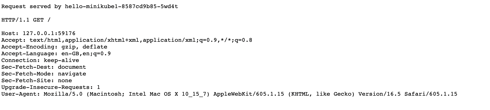

# Pod to Service communication

A [Service](https://kubernetes.io/docs/concepts/services-networking/service/) serves as a central entry point that allows Pods to communicate with one another. For instance, when a group of Pods (referred to as "backends") offers functionality to other Pods (known as "frontends") within your cluster, the backend Service will furnish the frontend with a list of backend Pods that the frontend can establish connections with.

There are four [Kubernetes Service types](https://kubernetes.io/docs/concepts/services-networking/service/#publishing-services-service-types):

- [ClusterIP](./pod-to-service.md#clusterip)
  - [Headless Service](#headless-service)
- [NodePort](#nodeport)
- LoadBalancer
- ExternalName

## DNS

Kubernetes creates [DNS records for Services](https://kubernetes.io/docs/concepts/services-networking/dns-pod-service/#services). You can contact Services with consistent DNS names instead of IP addresses.

"Normal" (not headless) Services are assigned DNS A and/or AAAA records, depending on the IP family or families of the Service, with a name of the form `my-svc.my-namespace.svc.cluster-domain.example`. This resolves to the cluster IP of the Service.

Headless Services (without a cluster IP) Services are also assigned DNS [A and/or AAAA records](https://en.wikipedia.org/wiki/List_of_DNS_record_types), with a name of the form `my-svc.my-namespace.svc.cluster-domain.example`. Unlike normal Services, this resolves to the set of IPs of all of the Pods selected by the Service. Clients are expected to consume the set or else use standard round-robin selection from the set.

## ClusterIP

ClusterIP is is the default type of Service. Kubernetes will assign an IP address from a pool of IP addresses that your cluster has reserved for that purpose.

Deploy the NGINX web server, and let's see how the ClusterIP is in action:

```bash
kubectl apply -f ../manifests/nginx-deployment.yaml
kubectl get svc
```

Output:

```bash
NAME            TYPE        CLUSTER-IP       EXTERNAL-IP   PORT(S)   AGE
kubernetes      ClusterIP   10.96.0.1        <none>        443/TCP   197d
nginx-service   ClusterIP   10.110.110.219   <none>        80/TCP    6s
```

Use the [nicolaka/netshoot](https://hub.docker.com/r/nicolaka/netshoot) image to execute network validations.

```bash
kubectl run tmp-shell --rm -i --tty --image nicolaka/netshoot -- /bin/bash
```

First, use [nslookup](https://www.ibm.com/docs/en/aix/7.2?topic=n-nslookup-command) to query the DNS for the Service name:

```bash
tmp-shell:~# nslookup nginx-service
Server:         10.96.0.10
Address:        10.96.0.10#53

Name:   nginx-service.default.svc.cluster.local
Address: 10.110.110.219
```

The DNS returns the IP address as we saw in the previous command.

We can use the [curl](https://everything.curl.dev/project) command to send an [HTTP](https://everything.curl.dev/protocols/curl#http) request to the Service name.

```bash
tmp-shell:~# curl nginx-service
Welcome to the home page of host nginx-5c7575f557-j2pzq!
tmp-shell:~# curl nginx-service
Welcome to the home page of host nginx-5c7575f557-vbglc!
tmp-shell:~# curl nginx-service
Welcome to the home page of host nginx-5c7575f557-82mx4!
```

The NGINX Service is associated with three Pods (as shown in the ENDPOINTS column). In this particular example, the Service directed the request to a different Pod each time:

```bash
kubectl get endpointslices.discovery.k8s.io                               
NAME                  ADDRESSTYPE   PORTS   ENDPOINTS                             AGE
kubernetes            IPv4          8443    192.168.49.2                          197d
nginx-service-5pf9n   IPv4          80      10.244.3.46,10.244.3.47,10.244.3.48   17m
```

Using [Kubeshark](https://kubeshark.co), it's possible to have a visual representation of the network traffic.


The `tmp-shell` Pod does DNS requests to resolve the A/AAAA records for `nginx-service.default.svc.cluster.local`. After that it sends a `GET` to the Service in port 80 and then it receives the answer from `10.244.3.48`.

### Headless Service

[Headless Service](https://kubernetes.io/docs/concepts/services-networking/service/#headless-services) is created by explicitly setting `ClusterIP` to `None` when creating the Service. That does not allocate an IP address or forward traffic. In my opinion, the main use case is for [Stateful](https://kubernetes.io/docs/concepts/workloads/controllers/statefulset/) applications, where the headless is responsible for the network identity of the Pods.

How is the IP discovery different from ClusterIP to Headless?

Make sure that you have the following manifests deployed:

```bash
kubectl apply -f ../manifests/nginx-deployment.yaml
kubectl apply -f ../manifests/nginx-svc-headless.yaml
kubectl get svc
```

Output:

```bash
NAME                     TYPE        CLUSTER-IP       EXTERNAL-IP   PORT(S)   AGE
kubernetes               ClusterIP   10.96.0.1        <none>        443/TCP   204d
nginx-headless-service   ClusterIP   None             <none>        80/TCP    2s
nginx-service            ClusterIP   10.110.110.219   <none>        80/TCP    7d6h
```

Use the [nicolaka/netshoot](https://hub.docker.com/r/nicolaka/netshoot) image to execute network validations.

```bash
kubectl run tmp-shell --rm -i --tty --image nicolaka/netshoot -- /bin/bash
```

Run [nslookup](https://www.geeksforgeeks.org/nslookup-command-in-linux-with-examples/) to query both services:

```bash
tmp-shell:~# nslookup nginx-service
Server:         10.96.0.10
Address:        10.96.0.10#53

Name:   nginx-service.default.svc.cluster.local
Address: 10.110.110.219
```

```bash
tmp-shell:~# nslookup nginx-headless-service
Server:         10.96.0.10
Address:        10.96.0.10#53

Name:   nginx-headless-service.default.svc.cluster.local
Address: 10.244.3.46
Name:   nginx-headless-service.default.svc.cluster.local
Address: 10.244.3.47
Name:   nginx-headless-service.default.svc.cluster.local
Address: 10.244.3.48
```

In the first case, the ClusterIP returns its own IP address. The headless Service returns the IP address of each Pod.

## NodePort

For a node port Service, Kubernetes additionally allocates a port (TCP, UDP or SCTP to match the protocol of the Service). Every node in the cluster configures itself to listen on that assigned port and to forward traffic to one of the ready endpoints associated with that Service. You'll be able to contact the `type: NodePort` Service, from outside the cluster, by connecting to any node using the appropriate protocol (for example: TCP), and the appropriate port (as assigned to that Service).

The Kubernetes control plane allocates a port from a range specified by `--service-node-port-range` flag (default: 30000-32767).

Example of NodePort:

1. Create a Kubernetes deployment

    ```bash
    kubectl create deployment hello-minikube1 --image=kicbase/echo-server:1.0
    ```

2. Create a Kubernetes service type NodePort

    ```bash
    kubectl expose deployment hello-minikube1 --type=NodePort --port=8080
    ```

3. Check Node Port

    ```bash
    kubectl get svc 
    NAME                     TYPE        CLUSTER-IP       EXTERNAL-IP   PORT(S)          AGE
    hello-minikube1          NodePort    10.98.219.195    <none>        8080:32692/TCP   24s
    ```

4. Run service tunnel (because I'm running on Minikube)

    ```bash
    minikube service hello-minikube1 --url
    ```

    Output:

    ```bash
    <http://127.0.0.1:59176>

    ❗  Because you are using a Docker driver on darwin, the terminal needs to be open to run it.
    ```

5. Try in your browser. The tunnel `59176`, directs the request to the NodePort on `32692`, and then to the Pod.


